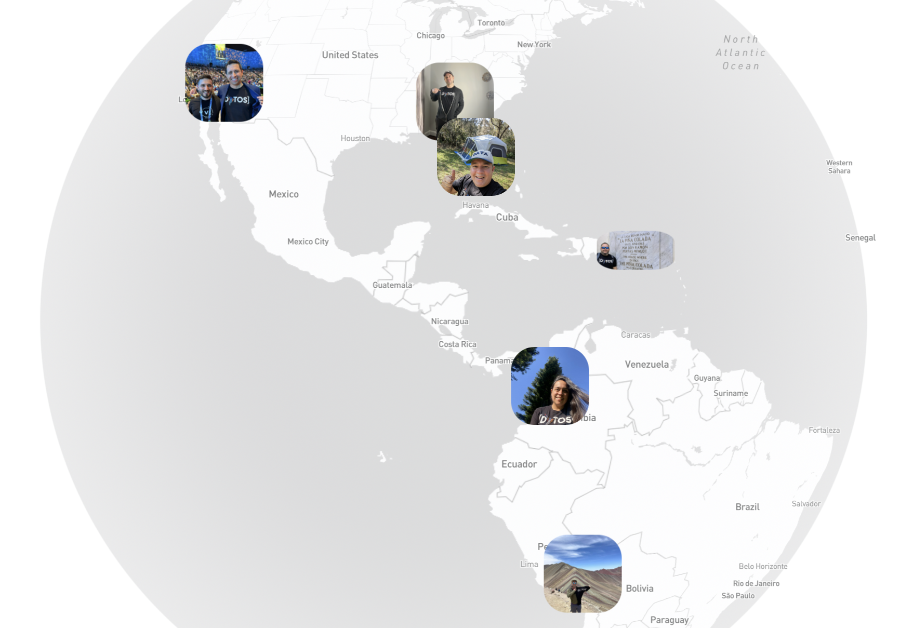

# comunidatosmap-en
Tableau Extension with Mapbox (English) - ComuniDatos T-shirts

Material for Data Dev Day Fall 2023 (Nov 2nd, 2023)

https://www.tableau.com/learn/webinars/datadev-day-2023-11-02

This demo is to show how to create Tableau Extension using Mapbox and dynamic photos from a Tableau Data Source
The idea was born from our Community ComuniDatos where we want to show a map with each person who used our t-shirt and took a photo in any place in the world.

 

# Tableau Developer Program

http://developer.tableau.com/

# Tableau Extensions

https://www.tableau.com/developer/tools/extensions-api
https://www.tableau.com/developer/learning/dashboard-extensions-api
https://tableau.github.io/extensions-api/docs/trex_getdata.html

# How to debug Tableau Extension

https://tableau.github.io/extensions-api/docs/trex_debugging.html

"C:\Program Files\Tableau\Tableau 2023.3\bin\tableau.exe" --remote-debugging-port=8696

http://localhost:8696/

# Tableau Cloud

https://online.tableau.com/
https://10ax.online.tableau.com/#/site/cristiansaavedradev226290/

# Mapbox

https://account.mapbox.com/
https://docs.mapbox.com/help/tutorials/custom-markers-gl-js/
https://docs.mapbox.com/mapbox-gl-js/example/custom-marker-icons/

# GitHub

https://github.com/cristiansaavedra/comunidatosmap-en/
https://github.com/cristiansaavedra/comunidatosmap-en/settings/pages

# GitHub Web pages:

https://cristiansaavedra.github.io/comunidatosmap-en/01_tableau_helloworld.html
https://cristiansaavedra.github.io/comunidatosmap-en/02_tableau_datatable.html
https://cristiansaavedra.github.io/comunidatosmap-en/03_mapbox_mapaonly.html
https://cristiansaavedra.github.io/comunidatosmap-en/04_mapbox_markers.html
https://cristiansaavedra.github.io/comunidatosmap-en/05_mapbox_markers_photo.html
https://cristiansaavedra.github.io/comunidatosmap-en/06_tableau_comunidatosmap.html

# GitHub Extensions:

https://github.com/cristiansaavedra/comunidatosmap-en
https://cristiansaavedra.github.io/comunidatosmap-en/

https://github.com/cristiansaavedra/TableauTREX-custom-parameter-ext
https://cristiansaavedra.github.io/TableauTREX-custom-parameter-ext/

# ========== Extras ==========

# My publications about Tableau Data Dev in Medium

https://cristiansaavedra.medium.com/list/crispubstableaudatadev-5eafcc48eb0e

# ComuniDatos

https://comunidatos.com/
https://youtu.be/iBxYnvD7h1E?si=ISuWLUujvPAZR5Kh (Spanish Version)

# Gigi - Extension from Scratch

https://www.youtube.com/watch?v=fdc9pd5QyeA&t=3s

# Keshia - Creating a Write-Back Extension from Start to Finish

https://www.youtube.com/watch?v=JyteK-EXbLs&t=2732s

# Merlijn - Zen Master: The What, Why, and How’s of Extensions for Tableau

https://www.youtube.com/watch?v=enef77PTIFk

# Developer deep dive | Dashboard extensions

https://www.youtube.com/watch?v=goiwdW3GU8I

# Promise Async JavaScript Events

https://developer.mozilla.org/en-US/docs/Web/JavaScript/Guide/Using_promises

# Video de Marc Reid: How to create a custom Mapbox map and use it in a Tableau dashboard

https://www.youtube.com/watch?v=bLPECLfS4ho

# Mapbox: Geographic Analytics Extension for Tableau

https://docs.mapbox.com/geographic-analytics/guides/

# Tableau Mapbox Extension: Mapbox Geospatial Analytics 

https://exchange.tableau.com/products/41

# Amazing Spiderman Mapbox

https://blog.mapbox.com/the-amazing-spider-map-b2cc59a4e9e2

# Community Portal

https://tableau.github.io/extensions-api/community/

# How to add markers to a map with Mapbox GL JS

https://www.youtube.com/watch?v=3gNIa1nLTcs

# Windows issue to load in Tableau Desktop

https://docs.mapbox.com/geographic-analytics/guides/

# Error for Map not loaded Microsoft Window

Go to the developer tools (F12 in the browser), then select the three dots in the upper right corner, and go to Settings.

Then, look for Sources, and disable the options:

"Enable JavaScript source maps"
"Enable CSS source maps"
